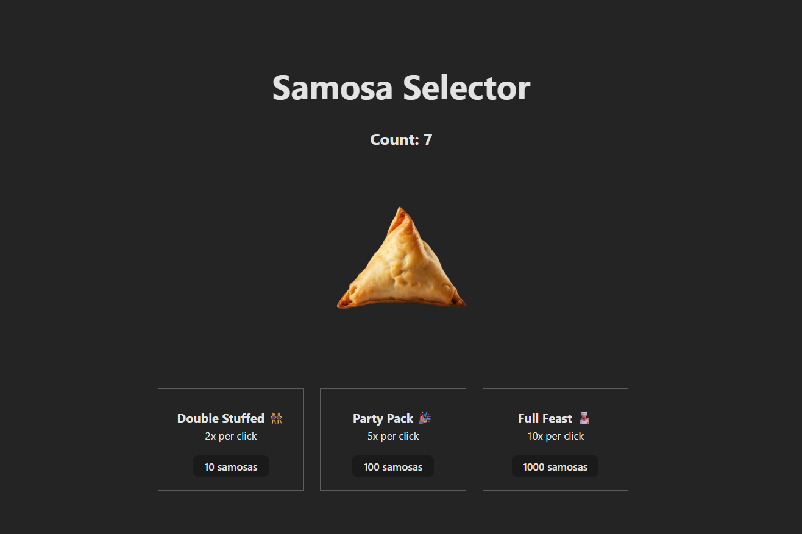

# 🥟 Samosa Selector – CodePath WEB102 Lab 2

**Samosa Selector** is a simple clicker-style web game inspired by Cookie Clicker — but with a tasty twist. Instead of clicking cookies, users select delicious samosas to rack up their count! The goal is to click the big samosa as many times as possible to increase your samosa count. This lab was built as part of **CodePath's WEB102 Lab 2**.

## 🎯 Lab Objective
This lab focuses on:
- Using **React `useState`** to manage and update component state
- Registering **`onClick` events** in a React app
- Defining and using **event handler functions**
- Practicing React fundamentals like state-driven rendering and component interaction

## 🛠️ Tech Stack
- ⚛️ **React** – Functional components and hooks
- ⚡ **Vite** – Development and bundling
- 🟨 **JavaScript (ES6+)** – For state logic and component behavior
- 🎨 **CSS** – For layout and style

## 🕹️ Features
- **Click Counter**: Click the samosa to increase your count
- **Real-time Updates**: Uses `useState` to reflect changes immediately
- **Simple Layout**: Designed to help reinforce the React event/state update cycle



## 📂 Project Structure
```
src/
├── App.css
├── App.jsx
├── index.css
└── main.jsx
index.html
```

## 🚀 Getting Started
### 1. Clone the repo:
```
git clone https://github.com/sixthsenseriot/lab-02-samosa-selector.git
cd lab-02-samosa-selector
```

### 2. Install dependencies:
```
npm install
```

### 3. Run the app:
```
npm run dev
```

### 4. View it locally:
Open http://localhost:5173 in your browser.

## 📝 Author
Created by **Khanh Nguyen** as part of CodePath's WEB102 curriculum.

## 📄 License
This project is for educational purposes under CodePath's Web Development 102 curriculum. Open for personal and learning use.

